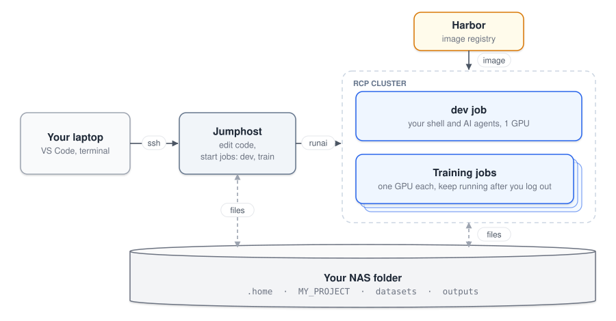

# RCP quickstart

RCP is EPFL's shared GPU cluster, a big pool of GPU machines used by many labs. You don't get your own GPU machine. You log into a small shared computer (the jumphost) and ask the cluster to run your program on a free GPU.

> [!CAUTION]
> **IMPORTANT: DELETE YOUR JOBS WHEN YOU ARE NOT USING THEM.**
>
> GPUs are limited and the whole lab shares them. A job holds on to its GPU as long as it exists, even if it sits idle and you have logged out. Each job you forget about blocks a GPU a labmate is waiting for.
>
> - When you stop working: `runai delete job dev`
> - Before you log out: `runai list` and delete anything you no longer need.

---

## Vocabulary

<details>
<summary>New to clusters? Open this for the words used in this tutorial (job, NAS, image, …).</summary>

| Word | What it means here |
| --- | --- |
| **CPU** | The computer's general-purpose processor. It runs your Python code, loads data and handles everything the GPU doesn't. A job asks for a number of CPU cores. |
| **GPU** | A graphics card used as a processor that does lots of simple calculations in parallel. Deep learning training is fast on a GPU and painfully slow on a CPU. A GPU has its own memory (e.g. 80 GB on an A100), separate from RAM. |
| **RAM (memory)** | The computer's working memory, where your program and its loaded data live while it runs. It's not the same thing as GPU memory or disk space. |
| **Cluster** | A lot of computers managed together and shared by many users. You don't choose a machine. The cluster finds free resources for you. |
| **Terminal / shell** | The window where you type commands. Every command runs on one specific computer: your laptop, the jumphost, or inside a job. |
| **SSH** | The command that opens a terminal on a remote computer. You reach the jumphost with `ssh rcp`. |
| **Jumphost** | The shared computer you log into. You edit code and start jobs from there. It has no GPU, so don't train on it. Coding assistants (Claude Code, Codex) can't run there either. They run inside a job. |
| **NAS** | The lab's network storage. Your folder is `/mnt/cvlab/scratch/cvlab/home/YOUR_USERNAME`. The jumphost and all your jobs see the same folder, a bit like a shared drive. Keep your code, data and results here (see [Where your files go](#where-your-files-go)). |
| **Job** | One run of your program on the cluster, with the GPUs, CPUs and memory you asked for. It starts once resources are free and stops when your program ends or when you delete it. |
| **Interactive job** | A job that gives you a terminal on a GPU machine, for testing and debugging. |
| **Training job** | A job that runs one command in the background, even after you log out. |
| **Image** | A snapshot of installed software (Linux, CUDA, Python, PyTorch, …) that a job starts from. The lab provides one (`cvlab-pancey/base`), so you don't have to install any of this yourself. |
| **Container** | A running copy of an image, inside your job. Anything written inside it is lost when the job ends, unless it's on the NAS. |
| **Harbor** | EPFL's container registry (`registry.rcp.epfl.ch`). It stores the files that make up each image, under a name and version. The cluster downloads them from there when a job starts. |
| **Virtual environment (venv)** | A folder, usually `.venv` in your project, that holds one project's Python packages so different projects don't clash. Running `.venv/bin/python` uses those packages. |
| **uv** | A tool that creates virtual environments and installs packages into them, much faster than `pip` and `python -m venv`. This tutorial uses it, but `python -m venv` or conda are fine too. |
| **Run:AI** | The system that runs jobs on the cluster. You talk to it with the `runai` command on the jumphost. |
| **Run:AI project** | Your account on Run:AI, usually named after the lab and your username. Your jobs count against it. |
| **GASPAR username** | Your EPFL login name. |

</details>



Before you start, ask your supervisor for RCP access. You'll need to be on the EPFL network or VPN.

In the commands below, words in CAPITALS (like `YOUR_USERNAME` or `YOUR_PROJECT`) are placeholders. Replace them with your own values.

---

## 1. Connect to the jumphost

On your laptop, create an SSH key and add two shortcuts, `rcp` and `rcp-plain`. Replace `YOUR_USERNAME` with your GASPAR username (it appears three times).

<details>
<summary>Linux / macOS (Terminal)</summary>

```bash
mkdir -p ~/.ssh
ssh-keygen -t ed25519 -f ~/.ssh/id_ed25519_rcp
cat >> ~/.ssh/config <<'EOF'

Host rcp
    HostName jumphost.rcp.epfl.ch
    User YOUR_USERNAME
    IdentityFile ~/.ssh/id_ed25519_rcp
    RequestTTY yes
    RemoteCommand cd /mnt/cvlab/scratch/cvlab/home/YOUR_USERNAME 2>/dev/null; exec bash -l

Host rcp-plain
    HostName jumphost.rcp.epfl.ch
    User YOUR_USERNAME
    IdentityFile ~/.ssh/id_ed25519_rcp
EOF
```

Then register the key on the jumphost. This is the only time it asks for your GASPAR password:

```bash
ssh-copy-id -i ~/.ssh/id_ed25519_rcp.pub rcp-plain
```

</details>

<details>
<summary>Windows (PowerShell)</summary>

```powershell
mkdir -Force "$env:USERPROFILE\.ssh" | Out-Null
ssh-keygen -t ed25519 -f "$env:USERPROFILE\.ssh\id_ed25519_rcp"
Add-Content -Encoding ascii "$env:USERPROFILE\.ssh\config" @"

Host rcp
    HostName jumphost.rcp.epfl.ch
    User YOUR_USERNAME
    IdentityFile ~/.ssh/id_ed25519_rcp
    RequestTTY yes
    RemoteCommand cd /mnt/cvlab/scratch/cvlab/home/YOUR_USERNAME 2>/dev/null; exec bash -l

Host rcp-plain
    HostName jumphost.rcp.epfl.ch
    User YOUR_USERNAME
    IdentityFile ~/.ssh/id_ed25519_rcp
"@
```

Then register the key on the jumphost. This is the only time it asks for your GASPAR password:

```powershell
Get-Content "$env:USERPROFILE\.ssh\id_ed25519_rcp.pub" | ssh rcp-plain "mkdir -p ~/.ssh && chmod 700 ~/.ssh && cat >> ~/.ssh/authorized_keys && chmod 600 ~/.ssh/authorized_keys"
```

</details>

When `ssh-keygen` asks for a passphrase, you can leave it empty (press Enter twice). On your first connection you'll be asked whether you trust the jumphost. Type `yes`.

Then create your NAS folder (you only do this once):

```bash
ssh rcp-plain 'mkdir -m 700 -p /mnt/cvlab/scratch/cvlab/home/YOUR_USERNAME'
```

From now on, `ssh rcp` logs you in without a password and drops you straight into your NAS folder. Use `rcp-plain` for everything else (VS Code, copying files, tunnels).

<details>
<summary>Why two shortcuts?</summary>

`rcp` runs a command when you connect, to move you into your NAS folder. Tools that send their own command, like VS Code, `scp` or `ssh rcp-plain 'some command'`, won't work with a connection like that. `rcp-plain` is the same connection without the extra command.

</details>

---

## 2. Set up your account (once)

Open a terminal on your laptop and connect with `ssh rcp`. Don't do this from VS Code, and keep VS Code closed until setup is done. Then download this tutorial into your NAS folder and run the setup script:

```bash
cd /mnt/cvlab/scratch/cvlab/home/YOUR_USERNAME
git clone https://github.com/PierreAncey/RCP_Quickstart.git RCP_tutorial
bash RCP_tutorial/setup-jumphost.sh
```

It goes through five steps, `[1/5]` to `[5/5]`, and finishes with `Setup complete`.

Next, load the new settings in your terminal. This is also what makes the `dev` and `train` commands available. Then log in to Run:AI (it prints a link to open in your browser) and pick your project:

```bash
source "$HOME/.bashrc"
runai login
runai list project
runai config project YOUR_PROJECT     # the name listed above
```

`runai list project` shows the projects you have access to. There's usually one, named something like `cvlab-YOUR_USERNAME`.

Last step: tell Git who you are and let it remember your GitHub or GitLab login. This is saved on the NAS, so it works inside jobs too:

```bash
git config --global user.name "YOUR_GIT_USERNAME"
git config --global user.email "YOUR_GIT_EMAIL"
git config --global credential.helper "store --file=$NAS_HOME/.home/.git-credentials"
```

The first time you push or clone a private repository, Git will ask for a username and password. Give your GitHub or GitLab username, and a **personal access token** as the password (not your account password). Git remembers it after that.

<details>
<summary>How do I create a personal access token?</summary>

- **GitHub:** Settings → Developer settings → Personal access tokens → Tokens (classic) → Generate new token, with the `repo` scope.
- **GitLab (EPFL):** your avatar → Preferences → Access tokens → Add new token, with the `read_repository` and `write_repository` scopes.

Copy the token straight away, because you only get to see it once. Use HTTPS repository URLs (`https://...`), not SSH ones (`git@...`).

</details>

Jobs run on the lab's default image, `registry.rcp.epfl.ch/cvlab-pancey/base:0.4`. It comes with CUDA, cuDNN, TensorRT, Python, uv and JupyterLab.

<details>
<summary>Did your supervisor give you a different image?</summary>

Put it in `IMAGE` in `rcp/project.env`. You can edit the file in VS Code, or with:

```bash
nano "$NAS_HOME/RCP_tutorial/rcp/project.env"
```

If you want to build your own image, see [Images](guides/images.md).

</details>

### VS Code

[VS Code](https://code.visualstudio.com/) gives you an editor and terminals on the jumphost, working directly on your NAS files. Any editor that works over SSH is fine (PyCharm, Cursor, Zed, Vim, …). We show VS Code here because most people use it.

**Once:**

1. In VS Code, open **Extensions** (**Ctrl+Shift+X**), install **Remote - SSH** (by Microsoft) and restart VS Code.
2. Press **F1**, type **Connect to Host** and pick **rcp-plain**. A new window opens. The first time, it may ask for the platform (choose **Linux**) and ask you to confirm the server's fingerprint (**Continue**). It then installs its server on the jumphost, which takes about a minute.
3. VS Code opens in your jumphost home, which is empty. Go to **File → Open Folder…**, replace the path with `/mnt/cvlab/scratch/cvlab/home/YOUR_USERNAME` and click **OK**. Answer **Yes** when it asks whether you trust the folder.

**Every day:**

1. Open VS Code, go to **File → Open Recent** and pick your NAS folder (it shows `[SSH: rcp-plain]`).
2. **Terminal → New Terminal** opens a jumphost terminal in that folder. This is where you start jobs, for example with `dev` (see step 3).

To work on a specific project, open its folder instead, e.g. `/mnt/cvlab/scratch/cvlab/home/YOUR_USERNAME/MY_PROJECT`. It will get its own entry in **Open Recent**.

---

## 3. Run your first job

```bash
cd "$NAS_HOME/RCP_tutorial"
dev
```

`dev`, `train`, `windows` and `rcp-init` are commands this tutorial adds (step 2 set them up). You won't find them in standard Linux or Run:AI. `dev` starts your interactive job (called `dev`), or reconnects to it if it's already there, and opens a shell in the folder you ran it from. By default the job gets 1 GPU, 8 CPUs and 32 GiB of RAM.

While the job starts, it prints its status: `dev: Pending` while it waits for a free GPU, then `dev: Running`. The first time can take several minutes, because the machine also has to download the image. Once your prompt changes to `YOUR_USERNAME@dev:...$`, you're inside the job. Try:

```bash
nvidia-smi              # shows the job's GPU
python3 hello_rcp.py    # prints "Hello from dev-0-0, ..." and where it saved a file
exit
```

> [!CAUTION]
> **IMPORTANT:** the job keeps running after you leave its shell, and it holds a GPU until you delete it. **Always delete it when you stop working**, so others can use the GPU.

```bash
runai delete job dev
runai list              # check that none of your jobs is left running
```

You're all set. If you like, set up a coding assistant next, then [run your own project](guides/cluster.md).

---

## 4. (Optional) Set up a coding assistant

Coding assistants keep getting more popular and more capable. They're most useful when they can run your code themselves, so this setup supports them out of the box. Claude Code and Codex can't run on the jumphost. They run inside a job instead, which also gives them a GPU. You install them once. They live in your NAS home along with their logins and conversations, so every job after that has them.

```bash
dev                                                 # on the jumphost
bash "$NAS_HOME/RCP_tutorial/setup-agents.sh"       # inside the job: installs both
claude                       # log in to Claude Code: follow the link it prints
codex login --device-auth    # log in to Codex: enter the code it prints in your browser
```

After that, here's how to start an assistant in a job:

```bash
dev                          # on the jumphost, in your project folder
tmux new -A -s agent         # inside the job: keeps the assistant running if your connection drops
claude                       # or: codex
```

[Coding assistants](guides/agents.md) explains how to run several assistants side by side with `windows`, and how to let them use the cluster for your project (start training jobs, read logs, clean up). Delete the job when you're done: `runai delete job dev`.

---

## Where your files go

Everything lives in your NAS folder, so the jumphost and all your jobs see the same files:

```
/mnt/cvlab/scratch/cvlab/home/YOUR_USERNAME/     ($NAS_HOME)
├── .home/                your settings, tools and logins (hidden; your home folder inside jobs)
├── RCP_tutorial/         this tutorial
├── MY_PROJECT/           your code: a Git repository, with the rcp/ folder in it
├── datasets/             input data, shared by your projects                   ($DATA_DIR)
└── outputs/
    └── MY_PROJECT/       results of one project                                ($OUTPUT_DIR)
        ├── jobs.log      every training job started or stopped
        └── runs/NAME/    one folder per training job: its output (log.txt), the code it ran, your results
```

Jobs get `$DATA_DIR` and `$OUTPUT_DIR` as environment variables, so your code can find its data and save results without hard-coded paths. You can add whatever other folders you want to your repository.

<details>
<summary>Are your data or results stored somewhere else?</summary>

Set `DATA_DIR` or `OUTPUT_DIR` in your project's `rcp/project.env`. The file explains how.

</details>

---

## Limits and GPU sharing

| | Interactive job (`dev`) | Training job (`train`) |
| --- | --- | --- |
| Use it for | Testing and debugging | Long runs |
| GPUs | 1 (A100 or V100, no H100/H200/B300) | Several at once if your code supports it, within the lab's share of the cluster |
| Maximum duration | 12 hours | Until the command finishes |
| Can be stopped by the cluster | No | Yes, and restarted later. Your program should save checkpoints regularly and pick up from the last one |

Everyone in the lab shares the same GPUs, and the lab only gets a limited number of them on RCP. Any job you leave running blocks a GPU someone else is waiting for:

- Delete your interactive job (`runai delete job dev`) when you stop working, even if it's just for lunch or overnight. Starting it again only takes a minute.
- Delete training jobs once they've finished or failed, and stop any runs you don't need anymore.
- Only ask for as many GPUs as your code really uses.

The NAS is not backed up, so we recommend using Git to track, version and save your code.

---

## Guides

- [Daily work on the cluster](guides/cluster.md): your project, `dev`, training jobs and Python packages. Start here.
- [Coding assistants](guides/agents.md): give Claude Code or Codex what it needs to use RCP in your project.
- [Add RCP to any repository](rcp/README.md): the `rcp/` folder you copy into your projects.
- [Jupyter](guides/jupyter.md): open a notebook that runs in a job from the browser on your laptop.
- [Laptop and cluster](guides/hybrid.md): use Git to switch between your own machine and the jumphost.
- [Images](guides/images.md): use an image with your code baked in, or build your own.

If you get stuck, ask a coding assistant or your supervisor. The official documentation is on the [RCP wiki](https://wiki.rcp.epfl.ch).
