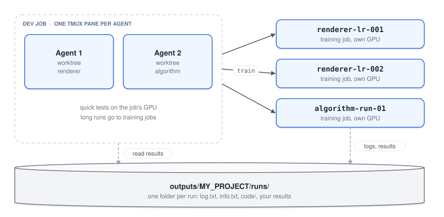

# Coding assistants

Coding assistants like Claude Code and Codex are becoming more popular and more capable every month. They help most when they can do more than edit files, like running your code on a real GPU, launching experiments and reading the results. This setup lets them do that.

The assistants run inside your `dev` job, not on the jumphost. From there they can run your code on the GPU and handle training jobs for you: start them, follow them and stop them.

> [!IMPORTANT]
> This guide assumes you've already done the [account setup](../README.md#2-set-up-your-account-once) and [installed the assistants](../README.md#4-optional-set-up-a-coding-assistant). Without those, the commands below won't work.

Words in CAPITALS are placeholders for your own values.

---

## Start an assistant

On the jumphost, from your project folder:

```bash
dev
```

Then, inside the job:

```bash
tmux new -A -s agent     # keeps the assistant running if your connection drops
claude                   # or: codex
```

If your connection drops, run `dev` and `tmux new -A -s agent` again and you'll be back in the same session.

The `dev` job stops after 12 hours. When that happens, start it again and pick up the last conversation with `claude --continue` (or `codex resume`).

---

## Give it the RCP context (once per project)

On its own, the assistant has no idea it's running on a cluster. `rcp/agent-instructions.md` explains it in one short page:
- it runs in a job, and long runs belong in training jobs
- where data and results live, and that it must never delete them
- how to start, follow, read and stop training jobs, and what each exit code means
- GPUs are shared, so it should stop training jobs as soon as they're done, but never its own job

Assistants read their instructions from `AGENTS.md` at the root of the project. Codex has always done this. Since September 2026 (version 2.1.277), Claude Code reads `AGENTS.md` too, the same way as its own `CLAUDE.md`, when the project has no `CLAUDE.md`. So one file works for both.

The quickest way is to run `rcp-init` from the project folder. It adds or refreshes the notes, the Claude Code settings below and the worktree line in `.gitignore`, and it won't overwrite anything of yours. **If you ran `rcp-init`, skip to [Several agents at once](#several-agents-at-once).**

If you'd rather do it by hand:

```bash
cp rcp/agent-instructions.md AGENTS.md
```

<details>
<summary>Your project already has an <code>AGENTS.md</code>?</summary>

Don't overwrite it. First check whether it already has the RCP notes:

```bash
grep -n RCP AGENTS.md
```

If this prints nothing, add the notes at the end of the file:

```bash
cat rcp/agent-instructions.md >> AGENTS.md
```

If `grep` prints lines, the notes are already there and you have nothing to do.

</details>

<details>
<summary>A past project uses <code>CLAUDE.md</code>?</summary>

Claude Code reads a `CLAUDE.md` instead of `AGENTS.md`. You can keep using it and append the RCP notes:

```bash
cat rcp/agent-instructions.md >> CLAUDE.md
```

Or add the line `@AGENTS.md` to it so Claude Code reads `AGENTS.md` as well.

</details>

Commit the file with your code so the context stays with the project. Ask the assistant to keep its own notes in a separate `## Project notes` section, because `rcp-init` refreshes the RCP section when you update it.

---

## Let Claude Code run job commands without asking

Skip this if you ran `rcp-init`. By default, Claude Code asks before every command. To let it start, follow and stop training jobs on its own, run this from the project folder (it will still ask about anything else):

```bash
mkdir -p .claude
cp rcp/claude-settings.json .claude/settings.json
```

Whatever the assistant decides, these settings also block:
- deleting jobs directly with `runai delete` (it has to use `rcp/stop.sh`, which won't touch your `dev` job or other projects' jobs)
- starting jobs with `runai submit` (it has to use `rcp/train.sh`, which keeps a log and a copy of the code)
- `rm -rf`, and any edit in your `datasets` folder
- Git commands that throw away work: `git reset --hard`, `git clean`, `git push --force`, `git branch -D`, `git checkout -- …`, `git restore`, `git stash drop`.

Training jobs can't overwrite each other either, since `train.sh` refuses a name that was already used.

<details>
<summary>Your project already has a <code>.claude/settings.json</code>?</summary>

Don't overwrite it. Open both files and copy the lines under `"allow"` and `"deny"` from `rcp/claude-settings.json` into the matching lists in `.claude/settings.json`.

</details>

---

## Several agents at once



`windows` opens several assistants inside the job, laid out as a grid of tmux panes:

```bash
windows               # 4 panes with Claude Code (the default)
windows 6 codex       # 6 panes with Codex
windows 2 half        # half Claude Code, half Codex (the number must be even)
windows 4 bash        # 4 plain shells, to start whatever you want in each
```

To type in a pane, click it, or press **Ctrl+B** and then an arrow key. If your connection drops, run `dev` again, then `tmux attach -t agents`.

All panes start in the same folder. That's fine when the agents only read code or work on separate files. If they edit different parts of the project, give each one its own worktree as described below. Start the grid with `windows 2 bash`, then run `claude --worktree NAME` in each pane.

### One worktree per agent

To have two assistants work in parallel (say, one on the renderer and one on an algorithm), give each its own **Git worktree**. A worktree is a separate copy of the project on its own branch, sharing the same repository. The agents never edit the same files, and you merge each branch once its work is done. Anthropic and OpenAI both recommend this approach.

Once per project, ignore the worktrees folder (`rcp-init` already does this):

```bash
echo ".claude/worktrees/" >> .gitignore
git add .gitignore && git commit -m "Ignore worktrees"
```

Then, inside `dev`, open two panes with plain shells:

```bash
windows 2 bash
```

and start one agent in each pane:

```bash
claude --worktree renderer      # left pane: works in .claude/worktrees/renderer, branch worktree-renderer
claude --worktree algorithm     # right pane
```

With the project's `.claude/settings.json`, a worktree starts from your current local work.

<details>
<summary>With Codex?</summary>

Codex doesn't create worktrees itself, so create one and start Codex inside it:

```bash
git worktree add .claude/worktrees/renderer -b renderer
cd .claude/worktrees/renderer && codex
```

</details>

Each worktree needs its own Python environment, so run `uv venv --system-site-packages` and `uv pip install -r requirements.txt` once inside it. All worktrees share the project's output folder. Each agent starts its job names with its worktree name (`renderer-...`, `algorithm-...`), which keeps their runs apart. For quick tests they share the single GPU of `dev`, and each training job gets its own GPU.

When an agent is done, merge its branch from the main project folder (`git merge worktree-renderer`) and remove the worktree with `git worktree remove .claude/worktrees/renderer`.

---

## Good habits

- Run `runai list` now and then. A forgotten training job keeps holding its GPU.
- Ask the assistant to keep its notes in `AGENTS.md` up to date (what it changed, what runs, where the results are) so the next session can pick up where it left off.
- If `runai` says you are not logged in, run `runai login` on the jumphost yourself. The assistant can't do it because it needs your browser.
