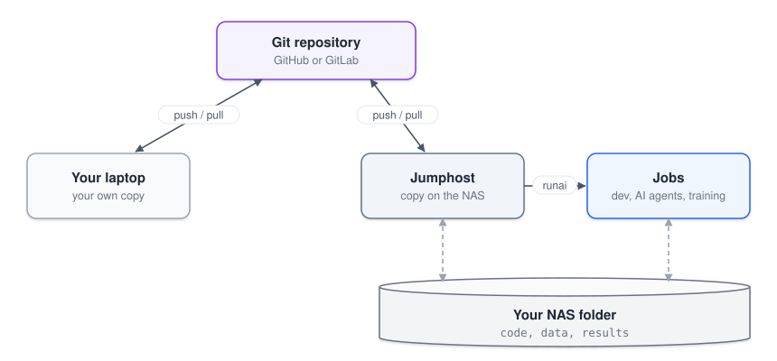

# Laptop and cluster

Some people prefer writing code on their laptop with a local assistant and only using the cluster for heavy runs. Git moves the code between the two. On the cluster side, the assistant runs inside a job, and jobs start from the jumphost, as in the [daily workflow](cluster.md).



---

## Keep one set of notes

Coding assistants don't share memory between machines, so keep what they need to know in the repository, in `AGENTS.md`. Both Codex and Claude Code read it. Put in what the project does, how to run the tests and the cluster notes from `rcp/agent-instructions.md`, then add a short section at the end:

```markdown
## Handoff

Last change, what was tested, next step, running jobs and where their results are.
```

Before switching machines, ask the assistant to update the handoff, then commit and push.

---

## Switching

Leaving the laptop:

```bash
git add -A
git commit -m "Describe the change"
git push
```

On the jumphost:

```bash
cd "$NAS_HOME/MY_PROJECT"
git pull --ff-only
```

Then start `dev` and the assistant in it, as in [Coding assistants](agents.md).

Going back works the same way in reverse. `--ff-only` won't merge silently. If it fails, one side has uncommitted or diverging changes, so sort those out first.

A few rules to avoid losing work:

- Edit in one place at a time.
- Don't `git pull` while `dev` is running code from that folder. Jobs started with `train` are fine, since they run a copy.
- Keep data, outputs, checkpoints and `.env` files out of Git (add them to `.gitignore`).
- Each machine needs its own assistant login. Git carries the notes, but not the conversations.
