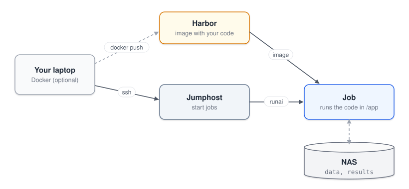

# Images

An image is the software environment of a job: the operating system, CUDA, Python and libraries. It's built once and uploaded to a registry, [Harbor](https://registry.rcp.epfl.ch), and every job downloads it from there. You log in to Harbor with your GASPAR username. Most students use the lab image, `registry.rcp.epfl.ch/cvlab-pancey/base:0.1` (the default in `rcp/project.env`), and never build their own.

---

## An image that contains your code

Some projects ship their code inside the image, often in `/app`. Data and results still go on the NAS, because anything written inside the container is lost when the job ends.



Copy `rcp/` anywhere on the jumphost, then set the image and the code folder in `rcp/project.env`:

```bash
IMAGE=registry.rcp.epfl.ch/LAB_PROJECT/MY_IMAGE:1.0
WORK_DIR=/app
```

Then use `dev` and `train` from that folder as usual. Every code change means building a new image, so this suits finished code better than development.

---

## Build your own image

Build an image when you need system packages, or a large Python environment that is slow to install on the NAS. You'll need [Docker](https://docs.docker.com/get-docker/) on your laptop, since the jumphost can't build images.

[image/Dockerfile](../image/Dockerfile) is a starting point with CUDA and cuDNN, build tools, common command-line tools, Python, uv and JupyterLab. It contains no code. Add your packages, then build and push. `LAB_PROJECT` is the lab's project on Harbor, where images are stored. Ask your supervisor which one to use.

```bash
docker login registry.rcp.epfl.ch
docker build --platform linux/amd64 -t registry.rcp.epfl.ch/LAB_PROJECT/MY_IMAGE:0.1 image
docker push registry.rcp.epfl.ch/LAB_PROJECT/MY_IMAGE:0.1
```

Put the new address in `IMAGE` in `rcp/project.env`. Give every build a new tag (`0.2`, `0.3`, …) so that running jobs keep the version they started with.

<details>
<summary>Your Harbor project is private?</summary>

The cluster also needs permission to download the image. Either make the project public, or follow the robot account section of the [registry wiki page](https://wiki.rcp.epfl.ch/en/home/CaaS/FAQ/how-to-registry).

</details>

Jobs don't run as root, so they can't install system packages. Put everything you need in the Dockerfile.
