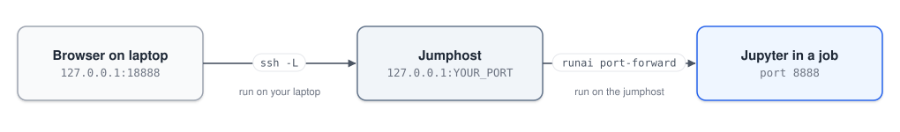

# Jupyter

Jupyter runs inside a job, but you use it from your laptop's browser. The connection goes through two "tunnels" (port forwarding): one from the jumphost to the job, and one from your laptop to the jumphost. A port is a numbered door on a computer that a program listens on.



Your image needs JupyterLab for this (the tutorial's [Dockerfile](../image/Dockerfile) already includes it).

**1. In a job shell** (`dev`):

```bash
jupyter lab --ip=0.0.0.0 --port=8888 --no-browser
```

Leave it running. It prints an address like `http://127.0.0.1:8888/lab?token=3f9c2a…`. The **token** is the part after `token=` and works as a password for your notebook. If it scrolls out of view, run `jupyter server list` in another shell in the job (`dev`) to see it again.

**2. In another jumphost terminal.** The jumphost is shared, so everyone uses their own port, computed from their user ID:

```bash
PORT=$((20000 + $(id -u) % 10000))
echo "Your port: $PORT"
runai port-forward dev --port $PORT:8888 --address localhost
```

**3. On your laptop** (Terminal or PowerShell), with the port printed above:

```bash
ssh -N -L 18888:127.0.0.1:YOUR_PORT rcp-plain
```

You'll see the jumphost's welcome banner and then nothing else. That's normal, it means the tunnel is open. Go to http://127.0.0.1:18888 and paste the token. Keep all three terminals open. On the laptop side we use 18888 instead of 8888, because 8888 is often taken there already (by a local Jupyter or by VS Code).

<details>
<summary>Your project's packages are missing in the notebook?</summary>

The notebook uses the image's Python. To use your project's `.venv` instead, register it as a kernel once. Do this inside `dev`, from the project folder:

```bash
uv pip install ipykernel
.venv/bin/python -m ipykernel install --user --name MY_PROJECT
```

Then pick **MY_PROJECT** from Jupyter's kernel menu.

</details>

**With VS Code**, you can skip step 3. In the **Ports** panel next to the terminal, click **Forward a Port**, enter your port from step 2 and open the local address VS Code gives you. VS Code sometimes forwards port **8888** on its own after it sees Jupyter's address in a terminal. Ignore that one, because it points at the jumphost, not at your job.
